# Screenshots

> **Disclaimer:** Each screenshot may have been taken in a different session. As a result, the data, values, and simulation state shown across screenshots may not be consistent with one another.

---

## Chatbot – System

### How can I prepare the data?
The chatbot explains the steps required to generate simulation data so that reports can be run, including the `--generate-data` command and how to configure `simulation.json`.

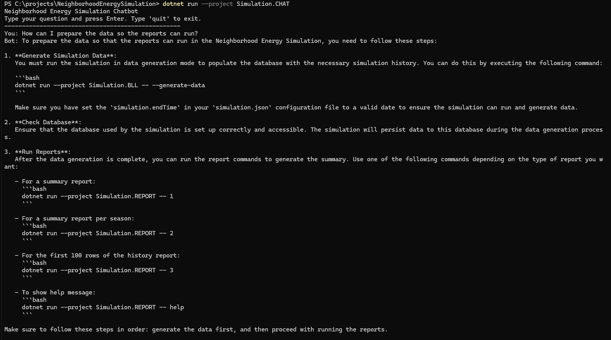

---

### How can I run the visual simulation?
The chatbot provides step-by-step instructions for building the project and launching the Blazor UI visualisation, including the URL to open in a browser.

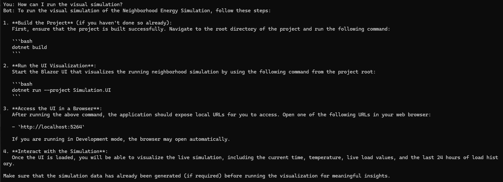

---

## Chatbot – General

### What can you tell me about the system in general?
The chatbot gives a high-level overview of the Neighborhood Energy Simulation project, describing its architecture (BLL, DAL, REPORT, UI, CHAT, TEST), key features, design philosophy, limitations, and use cases.

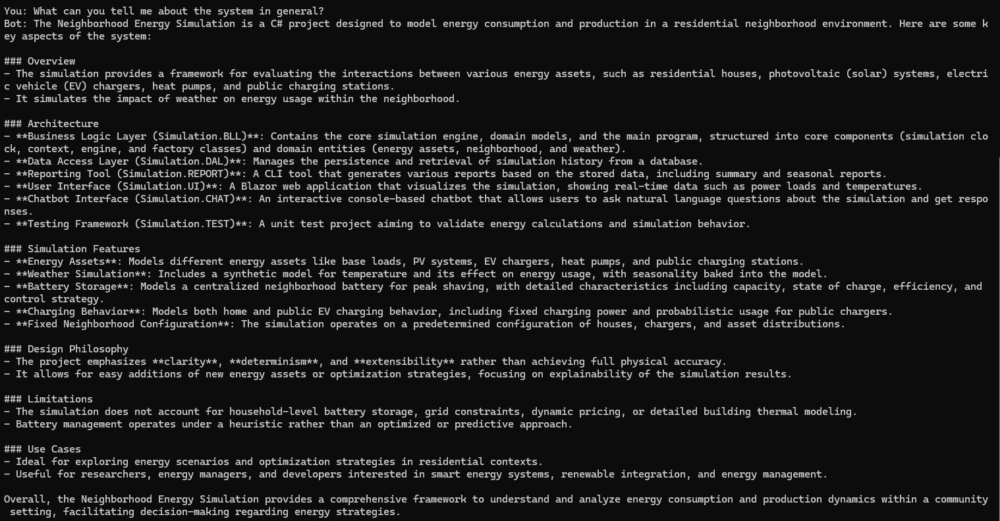

---

### Show me the breakdown of the current settings
The chatbot presents a detailed breakdown of the active simulation configuration, covering simulation time range, neighbourhood setup (houses, chargers, asset probabilities), individual asset parameters (base load, PV, heat pump, EV chargers, public chargers), battery configuration, and seasonal weather settings.

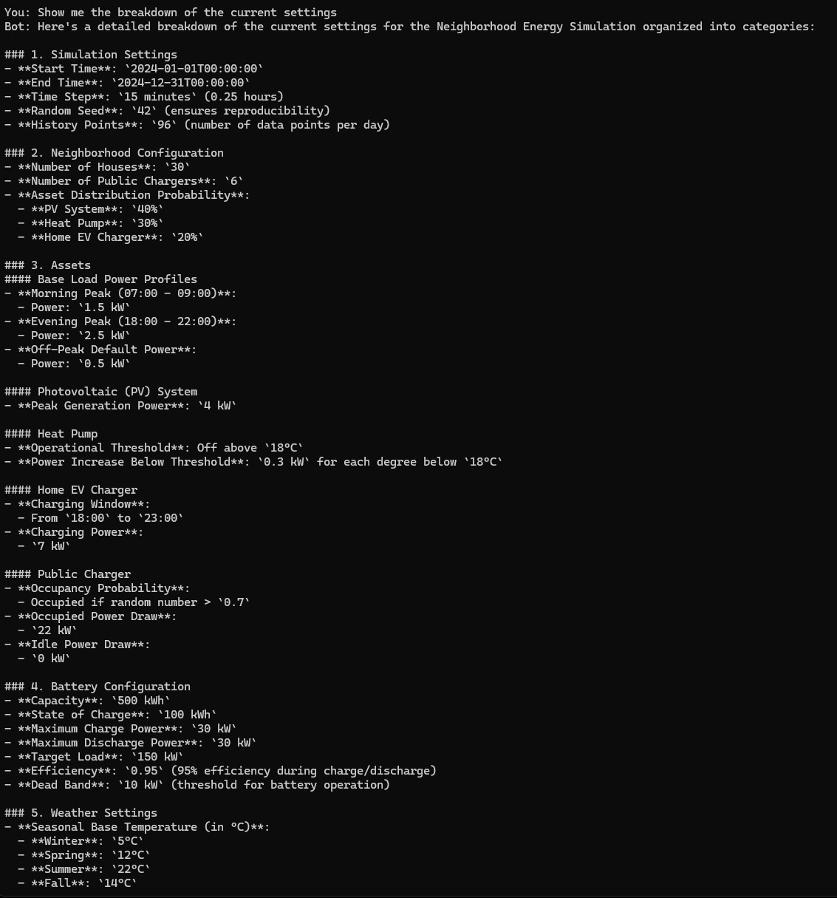

---

## Chatbot – Analyse

### Please, show me the simulation summary
The chatbot retrieves and displays the full simulation summary, including total rows, simulation period, energy statistics (with and without battery), peak and average power figures, standard deviation, battery capacity, utilisation rate, and peak reduction.

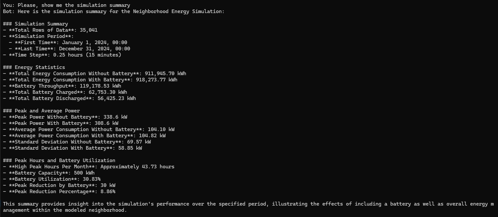

---

### Summarize it for me
Following the full summary, the chatbot produces a concise narrative overview of the key findings: energy consumption with and without battery, power statistics, and battery performance metrics.

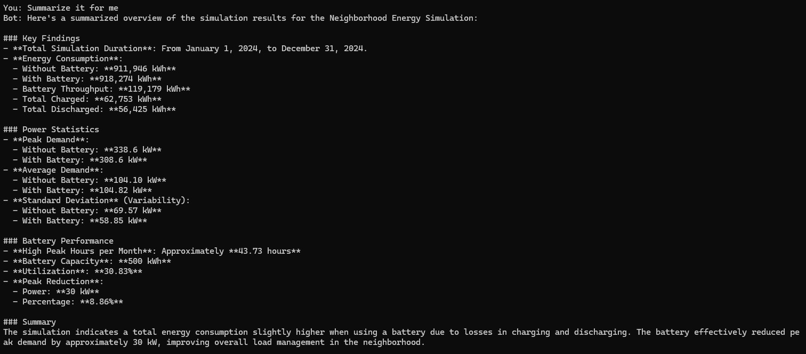

---

### During which season we use the most energy?
The chatbot breaks down energy usage by season (Winter, Spring, Summer, Fall) and concludes that Winter has the highest total consumption and peak demand, driven by greater heating loads during colder months.

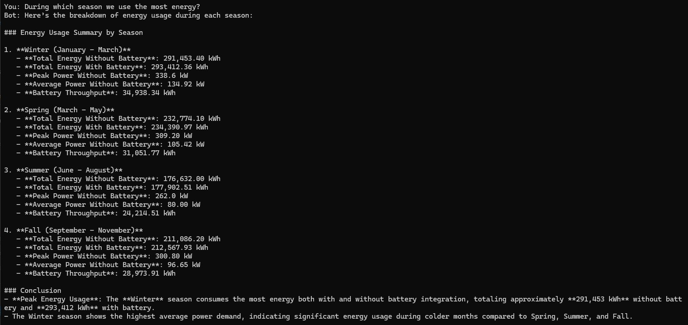

---

### Would it be a good idea to increase the capacity of the battery to 1000 kWh?
The chatbot analyses the pros (increased storage, enhanced peak shaving, improved utilisation, better buffering) and cons (cost, diminishing returns, added complexity, environmental considerations) of doubling battery capacity, and provides a balanced recommendation.

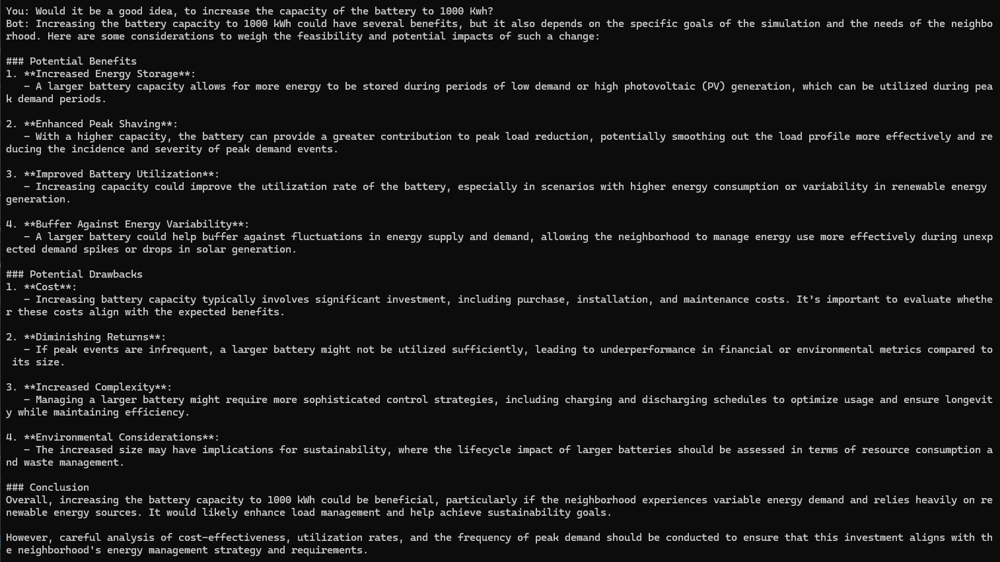

---

### How much can we reduce it without impacting peak shaving?
Building on previous analysis, the chatbot estimates how much the battery capacity could safely be reduced while maintaining effective peak shaving, providing a capacity reduction formula and concluding that a 20–30% reduction (down to 350–400 kWh) may be feasible.

---

## Reports

### Summary Report
CLI output of the overall simulation summary report (`dotnet run --project Simulation.REPORT -- 1`), showing totals for energy consumption (with and without battery), battery throughput, peak and average loads, standard deviation, battery utilisation, and peak reduction for the full simulation period.

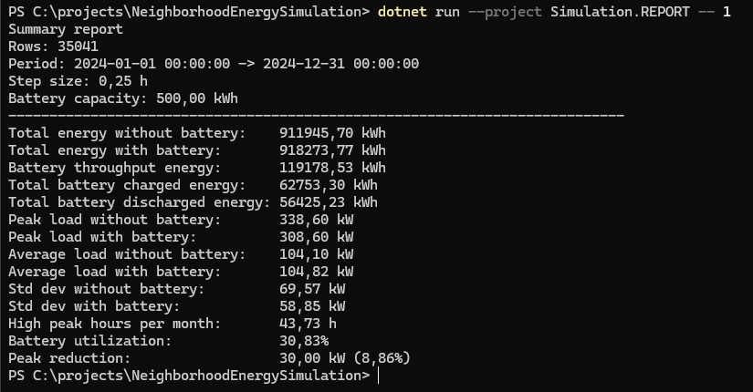

---

### Summary Per Season Report
CLI output of the per-season summary report (`dotnet run --project Simulation.REPORT -- 2`), providing the same key metrics broken down individually for Fall, Spring, Summer, and Winter.

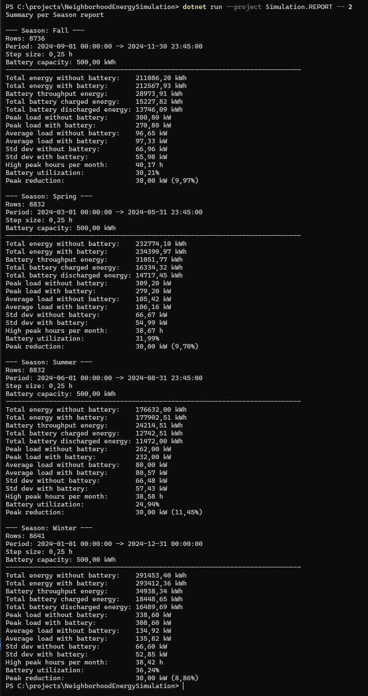

---

### History Report
CLI output of the raw history table report (`dotnet run --project Simulation.REPORT -- 3`), displaying the first rows of the simulation history with columns for time, season, temperature, load, load with battery, battery power, battery state-of-charge, cumulative total energy, and rolling peak values.

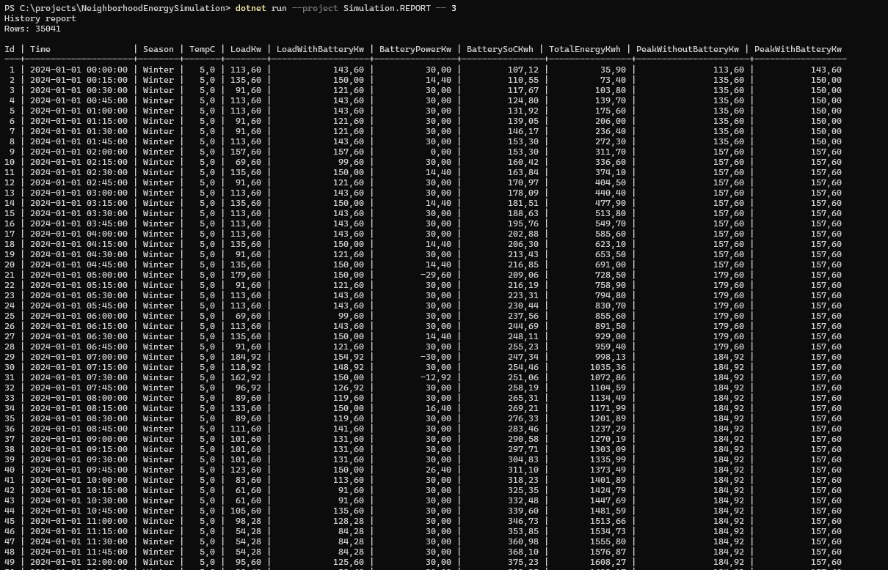

---

## UI

### Visualisation – Charging
The Blazor UI dashboard captured while the battery is in **Charging** state. Displays current simulation time (1 Jan 2024 12:30), Winter temperature (5.0 °C), current load with and without battery, peak reduction, cumulative total energy, and battery state-of-charge (389.48 kWh). The chart shows the last 24 hours of load profiles for both the raw load and the battery-smoothed load.

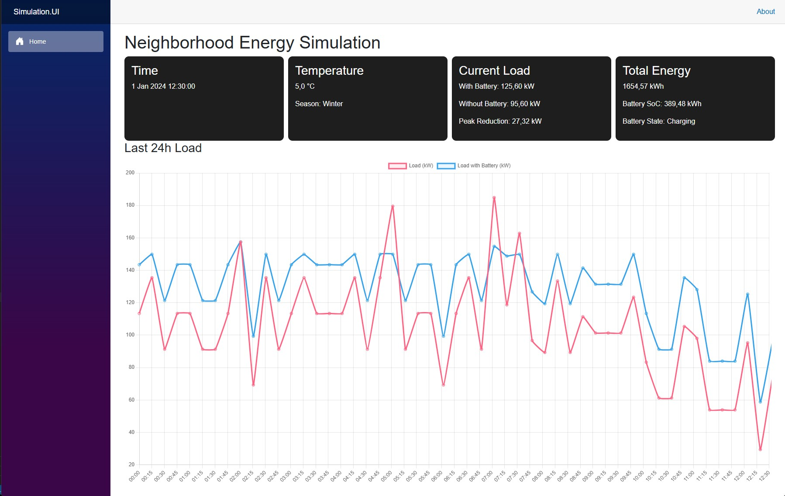

---

### Visualisation – Discharging
The Blazor UI dashboard captured while the battery is in **Discharging** state. Captured on 2 Jan 2024 at 20:15 during a Winter evening peak, where the battery is actively reducing the load from 272.60 kW to 242.60 kW. The chart clearly shows the battery absorbing the evening demand spike.

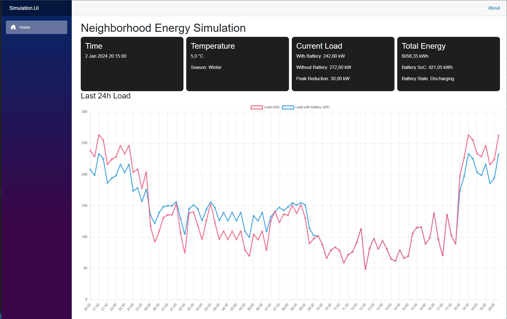

---

### Visualisation – Full (Battery at Capacity)
The Blazor UI dashboard captured while the battery is in **Charging (Full)** state (SoC: 500.00 kWh). Captured on 2 Jan 2024 at 10:00, during a period where the load with battery equals the raw load, indicating the battery is fully charged and not actively contributing to peak shaving. The 24-hour chart illustrates a full overnight-to-morning load cycle.

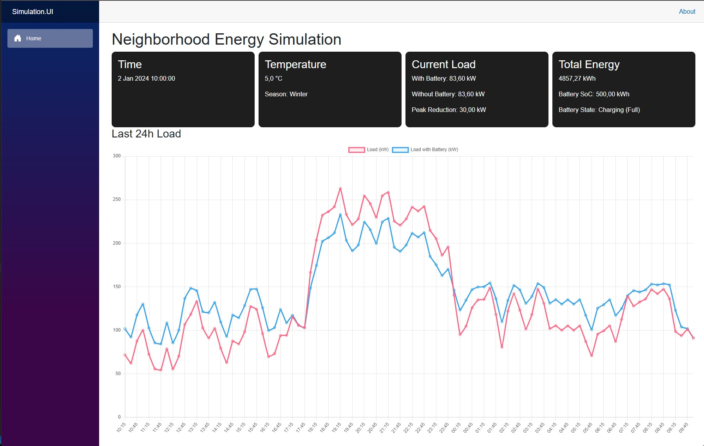
