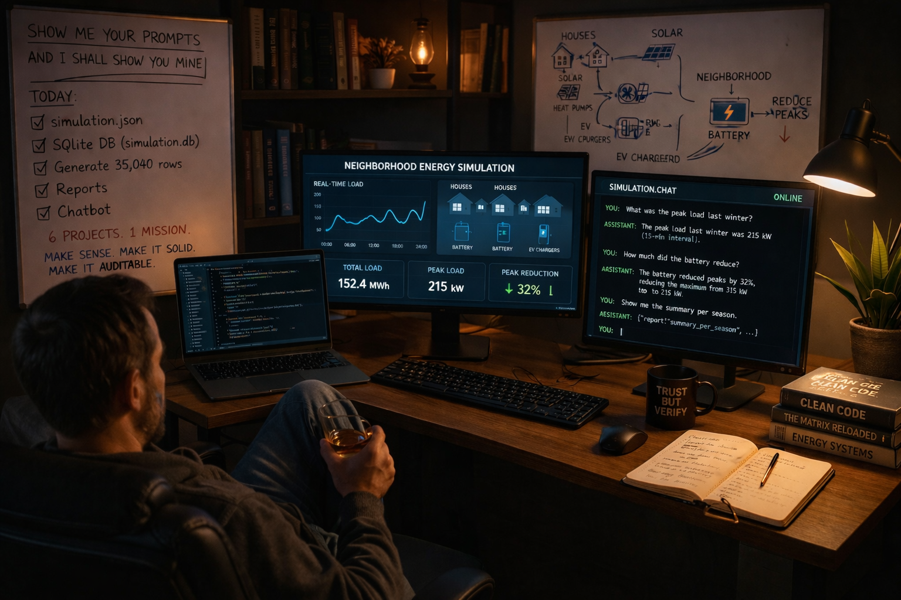
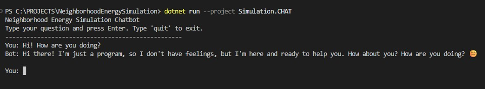
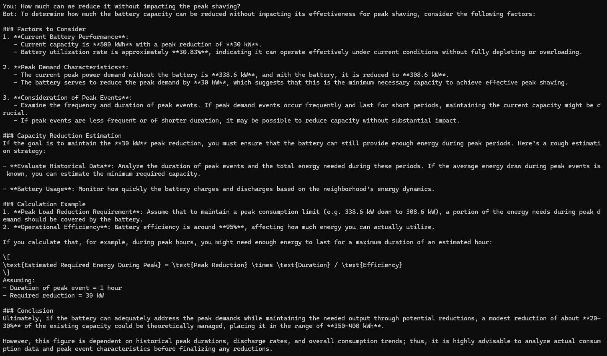

I was recently asked, during a job interview, to build a Neighborhood Energy Simulation.

A bunch of houses with heat pumps, solar panels, and EV chargers (someone probably owns a Tesla), plus the usual base load. The neighborhood itself also has public EV chargers — for passing-by IT specialists — and a shared battery to reduce peak load below a certain threshold.

And of course… there was a time constraint.

Fine.

It sounded fun — and it was.

Thankfully, I was allowed to use coding agents. There was just one condition:

> Don't tell me how you did it — show me your prompts.

That's the reality these days.

**I didn't get the job**

…but the project stayed with me.

Later that evening — wife away, glass of whiskey in hand — I decided to go a bit beyond the initial scope.

In other words: I completely over-engineered it.

---

## The idea

It started simple:

*Can I put an agent in the middle of this?*

Letting it run the whole simulation was tempting — just feed inputs and let it generate results. But that quickly falls apart in the real world.

If you're standing in front of a board of directors asking for millions, you need more than:

> "A crystal ball told me so."

You need solid, auditable reports.

So the question became:

*Can I talk to the data instead?*

---

## The problem with LLMs and raw data

LLMs are not great with raw datasets.

They'll try to:
- write code
- approximate answers
- or hallucinate patterns

But what they are very good at is:

**Analyzing structured summaries — especially JSON.**

And I needed reports anyway.

So… I had work to do.

---

## First reality check: UI is not value

I already had a real-time graph showing neighborhood load.


Looked great.  
Completely useless.

You watch it for 5 seconds and think:

*"Nice."*

Then what?

No decisions. No actions. No value.

We love pretty dashboards — but unless they answer a question or trigger an action, they're just… decoration.

Nobody sits there watching animated invoices fly across the screen.

---

## Step 1: Let the agent do the boring work

First things first: move all settings into a JSON file.

It's not hard — but it's tedious:
- copy-paste everything
- map parameters
- define defaults
- make sure nothing breaks

The kind of work where mistakes are guaranteed.

And then…

You type one sentence.

```
Can you gather all simulation settings and put them in a simulation.json file.
```

Done.

Watching that happen without lifting a finger…

That deserves another glass.

---

## Step 2: Data or it didn't happen

Time to add persistence.

I need reports, so I need data to run it from. It was time for a database.

```
Please, add a database support - SQLite (file simulation.db).
Add a project Simulation.DAL.
We need one table History with columns Id, CurrentTime and Load which will hold the data of Neighborhood.History.
The simulation will continue to go as it is now and the Neighborhood.History should stay the same.
We are just adding the information to the table, as well.
```

To make the data meaningful, I needed scale:
- 365 days
- 24 hours
- 15-minute intervals

That's **35,040 rows**.

Time to generate data.

Now we're talking.

---

## Step 3 – Generate data fast

The visualization loop was intentionally slow.  
Data generation shouldn't be.

I wasn't sure how the agent would approach it, so I asked it to plan first:

```
/plan
We need data so let's modify the Simulation.BLL to generate it.
Please, modify Program.cs to accept a parameter generate_data.
If run with no parameters, it should run the same way as now.
In generate_data mode, we don't need Thread.Sleep(settings.Runtime.ConsoleLoopSleepMs);
We call sim.Step(false); in the same loop;
The Step() function should only show a simple progress based on
(SimulationClock.EndTime - SimulationClock.CurrentTime) showing how much is done 0% - 100% complete;
```

The plan looked good.

Click.

---

## Step 4 – Reports – finally something useful

Now we're getting somewhere.

Start simple:

```
It is time to add a Simulation.REPORT project.
It should have one report showing all the records from the history table.
```

Then, summarize it.

```
Please, add summary report with totals and peak reduction metrics.
```

For the first time, I could see the whole picture.

---

## The moment of truth (and denial)

I looked at the results.

They seemed fine.

But I wasn't entirely convinced.

I could trace every number, but I'm not an expert — and at 22:00, there wasn't one around to sanity-check it.

So I turned to the only "expert" available at that hour: ChatGPT.

It wasn't impressed.

Not because the math was wrong…

…but because the **model was unrealistic**.

My first reaction? Denial.

As the Architect put it in *The Matrix Reloaded* (2003):

> "Denial is the most predictable of all human responses."

And… he wasn't wrong.

But after a bit of back-and-forth, it made sense.

A battery is not a bucket of water. You can't just:
- pour energy in infinitely
- pull it out instantly
- ignore physical constraints

A real expert — or a domain-trained model — would do better.

But honestly? ChatGPT did a pretty good job calling out the flaw.

And the best part? The system was modular enough to fix it easily.

---

## Step 5 – More perspective

Next step: seasonal summaries.

The simulation assumed winter would have the highest load.

But assumptions are cheap — data is better.

```
We need a new report Summary per Season.
Please, move the logic of #sym:HistorySummaryReport to a separate ReportHelper.cs
so it can be reused for the new report.
```

---

## Step 6 – CLI

Time to make it usable.

Turn the reporting project into a CLI.

```
/plan
Please, lets modify Program.cs to act like a CLI.
We need parameters
  1 - Print History Summary Report;
  2 - Print History Summary Report per Season Report;
  3 - Print History Report;
Please, add help so if the user runs it with help parameter or (without parameters)
it should provide information to how to use the CLI.
```

```
Please, modify README.md accordingly
```

---

## Step 7 – Make it AI-ready

Reports are great. But LLMs need structure.

```
/plan
I need all the SUMMARY reports to have a new function:
GetJson() which will return the report's result in JSON.
```

Now we can talk.

---

## Step 8 – Chatbot

Time to add a new project.

```
Let's add a new project Simulation.CHAT.
It will be a chatbot.
Please add a logic to accept user questions and for now, answer back with the user question.
The loop ends if the user write quit.
```

Some wiring, preparing the project… and then I added the chatbot myself.

Yes — manually. I know… shocking.

I had something simple in mind — something that would probably take longer to explain than to actually implement.

### First conversation

At first, it knew nothing. Just:

*"You are a helpful assistant."*

Charming.



Then I gave it tools:
- summary reports
- simulation settings

Now we could actually talk business.




---

## Final polish (a.k.a. deleting things)

By now, the solution had grown into 6 projects.

Documentation expanded. Assumptions accumulated.

Wouldn't it be nice if the assistant could explain the system itself?

Of course it would.

Nothing easier 😊

```csharp
private string GetInstructions() =>
    "You are a helpful assistant that answers questions about the neighborhood energy simulation. " +
    "Use the following information to answer questions:\n\n" +
    (_readmeContent != null ? $"Project documentation (README):\n{_readmeContent}\n\n" : "") +
    $"These are the simulation settings : {_settings?.GetSimulationSettingsJson()}\n" +
    "Use GetHistorySummaryReportJson to get a JSON report summarizing the simulation history.\n" +
    "You can also use GetHistorySummaryPerSeasonReportJson to get a JSON report summarizing the simulation history per season.";
```

### Final final cleanup

This is my favorite part.

Going through everything:
- removing things
- fixing names
- cleaning up the agent's version of over-engineering

Turns out, agents are very… thorough.

*"Let's add environment variables just in case someone runs this from another planet…"*

No. Delete.

Run tests after every change. Commit. Push. Repeat.

Run the simulation again.

Winter still uses the most energy.

Good.


---

## What's next?

This is still a PoC.

Plenty to improve:
- More tests
- Split agents (Q&A vs analysis)
- Add intent classification
- More reports
- Add cost modeling 💰

And the big one:

**Let the agent run the simulation itself.**

So instead of guessing:

*"What happens with 100 houses and a 1000 kWh battery?"*

It actually runs it. → generates reports → gives an answer.

And the results are still auditable.

---

## Closing thought

The assignment was about energy simulation.

But what stuck with me was something else:

*The shift from writing code… to designing systems that collaborate with intelligence.*

And maybe the real skill now isn't just coding.

It's knowing **what to build yourself** and **what to delegate to the machine**.

---

Please, check out the repository.

There is also a more detailed list of [snapshots](https://github.com/kiril-vassilev/neighbourhood-energy-simulation/blob/main/SCREENSHOTS.md)] (It did it 😊)

Thanks for reading it.

Questions, suggestions — always welcome.
